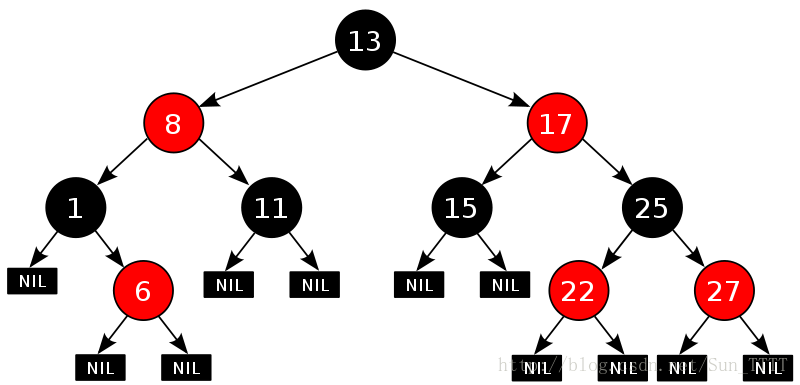

# 一、红黑树的概念及性质

**概念：**

红黑树，是一种二叉搜索树，但在每个结点上增加一个存储位表示结点的颜色，可以是 Red 或 Black。

通过对任何一条从根到叶子的路径上各个结点着色方式的限制，红黑树确保没有一条路径会比其他路径长出俩倍，因而是接近平衡的。

> 注：AVL树是严格平衡的二叉搜索树，左右子树高度不超过1；红黑树是近似平衡，最长路径不超过最短路径的二倍



**红黑树的性质：**

* 每个结点不是红色就是黑色；
* 根节点是黑色的；
* 如果一个节点是红色的，则它的两个孩子结点是黑色的；
* 对于每个结点，从该结点到其所有后代叶结点的简单路径上，均包含相同数目的黑色结点；
* 每个空结点都是黑色的（该条规则确定了路径条数）；

**为什么红黑树就能保证其最长路径中节点个数不会超过最短路径节点个数的两倍：**

红黑树第三条性质说明红黑树不能存在连续（父子相连）的红结点，可以存在连续的黑结点，又由于第四条性质每个路径上的黑结点个数都相同 ，所以对于最短路径来说一定是都是黑色结点，对于最长路径来说一定是黑色红色相间的路径，所以最长路径不超过最短路径长度的二倍。

# 二、红黑树结点的定义

对于红黑树来说以颜色来代替AVL树的平衡因子的作用，除此之外在定义上没有什么区别。

实现代码：

```c++
enum Colour //颜色
{
	RED,
	BLACK,
};
template<class K, class V>
struct RBTreeNode
{
	RBTreeNode<K, V>* _left;
	RBTreeNode<K, V>* _right;
	RBTreeNode<K, V>* _parent;

	pair<K, V> _kv;
	Colour _col;

	RBTreeNode(const pair<K, V>& kv)
		:_left(nullptr)
		, _right(nullptr)
		, _parent(nullptr)
		, _kv(kv)
		, _col(RED)
	{}
};
```

> 注：此处采用枚举来表示，当然也可以使用其他方式

**在节点的定义中为什么要将节点的默认颜色给成红色的：**

1. 如果默认颜色为黑，那么在插入中插入一个黑结点一定会让该路径上的黑结点数量加1，从而与其他路径上黑结点数量造成不一致，而一定会影响该棵红黑树；
2. 如果默认颜色为红，那么在插入中插入一个红结点，可能新插入结点的父结点为黑色结点则没有影响，也可能新插入结点的父结点为红结点，由于不能存在连续的（父子相连的）红色结点，而对该棵树造成影响；
3. 所以默认为红色比较黑色来说是好的；

# 三、红黑树的插入操作

红黑树是在二叉搜索树的基础上加上其平衡限制条件，当违反限制条件时就需要做出相应的调整。

红黑树的插入可分为两步：

1. 按照二叉搜索的树规则插入新节点

2. 新节点插入后检查红黑树的性质是否造到破坏

**注意：**

* 因为新节点的默认颜色是红色，如果其父亲节点的颜色是黑色，则没有违反红黑树任何性质，则不需要调整；

* 当新插入节点的父亲节点颜色为红色时，就违反了性质三不能有连在一起的红色节点，此时需要对红黑树分情况来讨论；

* 因为插入结点的父结点是红色的，说明父结点不是根结点（根结点是黑色的），因此插入结点的祖父结点（父结点的父结点）就一定存在；

* 红黑树调整时具体应该如何调整，主要是看插入结点的叔叔（插入结点的父结点的兄弟结点），根据插入结点叔叔的不同，可将红黑树的调整分为三种情况；

> 注：约定**cur**为当前节点，**p**为父节点，**g**为祖父节点，**u**为叔叔节点

## 1. 变色处理

情况一： **cur**为红，**p**为红，**g**为黑，**u**存在且为红

## 2. 单旋+变色

情况二：**cur**为红，**p**为红，**g**为黑，**u**不存在/**u**为黑

## 3. 双旋+变色

情况三： **cur**为红，**p**为红，**g**为黑，**u**不存在/**u**为黑

# 四、红黑树的验证

红黑树的检测分为两步：

1. 检测其是否满足二叉搜索树（中序遍历是否为有序序列）；
2. 检测其是否满足红黑树的性质；

# 五、红黑树的删除

红黑树的删除不做讲解，有兴趣可参考：《算法导论》或者《STL源码剖析》

> 参考链接：
> http://www.cnblogs.com/fornever/archive/2011/12/02/2270692.html
> http://blog.csdn.net/chenhuajie123/article/details/11951777

# 六、红黑树与AVL树的比较

* 红黑树和AVL树都是高效的平衡二叉树，增删改查的时间复杂度都是 $O(log_2n)$；

* 红黑树不追求绝对平衡，其只需保证最长路径不超过最短路径的2倍，相对而言，降低了插入和旋转的次数；

* 所以在经常进行增删的结构中性能比AVL树更优，而且红黑树实现比较简单，所以实际运用中红黑树更多；

> 转载自[C++红黑树](https://blog.csdn.net/CS_z_jun/article/details/123760622)